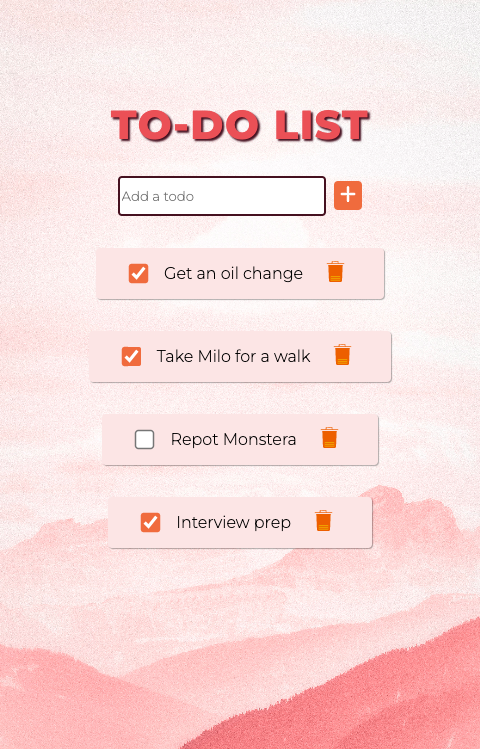

# Todo List

**_A simple todo list app for your daily tasks!_**

# Installation

1. Clone or download this repo.
2. Run `npm i` in the frontend and backend directories
3. Set environment variables:

### Backend setup

- Add .env file with PORT=8080, user=<db_user>, password=<db_password>
- Start the server: $node index.js

### Frontend setup

- Add .env file with REACT_APP_BACKEND_URL=http://localhost:8080
- Start the React app: $npm start

## Tech stack used

- React.js
- Sass
- Node.js
- Express.js
- MySQL
